# Hi there, I'm Bibuti Koley 👋

**Mobile Engineer — Android & Kotlin Multiplatform**

Building native and cross-platform mobile apps with a focus on clean architecture,
modern UI with Jetpack Compose, and secure, maintainable code.

---

## About Me

- 🔭 &nbsp;Currently working on **Android** and **Kotlin Multiplatform**
- 🌱 &nbsp;Currently learning **Flutter** and **iOS development**
- 👯 &nbsp;Open to collaborating on **email clients** and **code-streaming platforms**
- 🤔 &nbsp;Looking to go deeper into **advanced mobile app development** concepts
- 💬 &nbsp;Ask me about **Mobile App Development, Kotlin, Java, Compose, Multiplatform, Firebase, Architecture, Design Patterns and Data Security**
- ⚡ &nbsp;Fun fact: I like listening to music 🎧

## Tech Stack

**Languages**

**Frameworks & Platforms**

**Tools**

## 🚧 Currently Building

- **Android apps** with Jetpack Compose — modern declarative UI, clean architecture, and testable layers
- **Kotlin Multiplatform** — sharing domain and data logic across Android and iOS
- **Cross-platform exploration** — picking up Flutter and native iOS development to round out the mobile stack

## 🎯 What I Focus On

| Area | What that means in practice |
| --- | --- |
| **Architecture** | MVVM / MVI, clear module boundaries, dependency injection, code that survives feature growth |
| **Modern Android UI** | Jetpack Compose, Material 3, state hoisting, unidirectional data flow |
| **Kotlin Multiplatform** | Shared business logic, `expect`/`actual` boundaries, platform-idiomatic UI on top |
| **Data Security** | Secure storage, safe key handling, sensible auth and network hardening |
| **Backend-as-a-service** | Firebase — Auth, Firestore, Cloud Messaging, Crashlytics |

## 📈 GitHub Stats

  
  

  

These cards are generated daily by
<a href=".github/workflows/profile-stats.yml">a GitHub Action</a> and committed to this
repository, so they render from GitHub itself rather than a third-party service.

## 📫 Reach Me

---

Let's work collaboratively and make the best use of technology. 🚀
